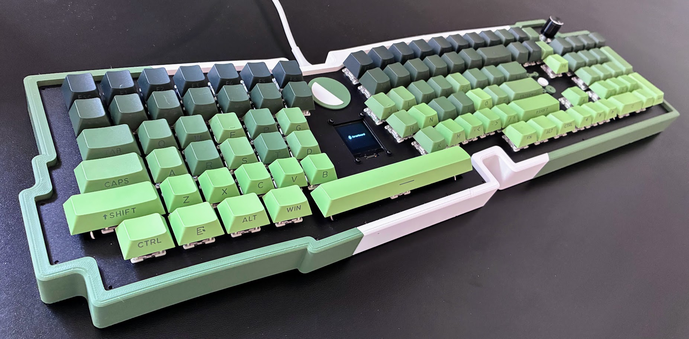
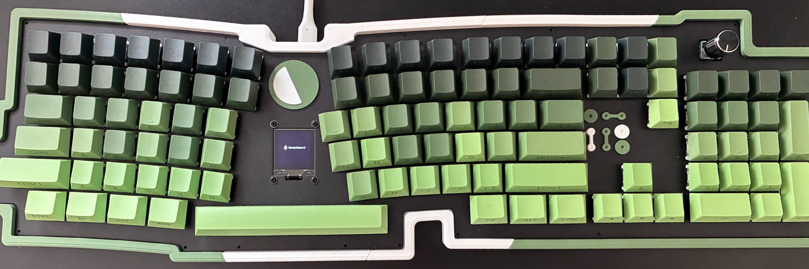

# cdaringe/forestboard - firmware

Firmware for a custom fixed-split keyboard with a rotary encoder and OLED screen.
Supports Colemak/QWERTY switching, volume controls, animations, and settings saved on the keyboard.

Set your computer’s keyboard layout to **US QWERTY**. The firmware starts in
Colemak; tap Layout/Settings to switch to QWERTY. If upgrading from the old
firmware, change the computer’s layout from Colemak to US QWERTY after flashing.

<a href="./assets/forest_board_1.jpg"></a>
<a href="./assets/forest_board_2.jpg"></a>

Built for the WeAct STM32F411RE CoreBoard, with STM32F446RE support.

## Build and flash

Requires Python 3, `make`, and `git`.

```sh
make setup   # Install PlatformIO and enable Git hooks
make build
```

Hold **BOOT0**, tap **RESET**, then release BOOT0 to enter the bootloader:

```sh
make upload
```

After upload, tap **RESET** again with BOOT0 released.

For the F446 board, add `ENV=genericSTM32F446RE` to build and upload commands.

## Controls

| Input | Action |
|---|---|
| Tap Layout/Settings | Switch Colemak / QWERTY |
| Hold Layout/Settings | Open settings |
| Turn / click knob | Volume / mute |
| Fn + turn knob | Change animation |

## Development

```sh
make test       # Host tests
make build-all  # Both boards, including OLED diagnostic builds
make check      # Formatting, tests, and all builds
```

Development checks also require G++, `clang-format`, and `ripgrep`.

More: [architecture](ARCHITECTURE.md), [animations](ANIMATIONS.md),
[test setup](test/README).

Send images from your computer with the [host display sender](DISPLAY_HOST.md).
